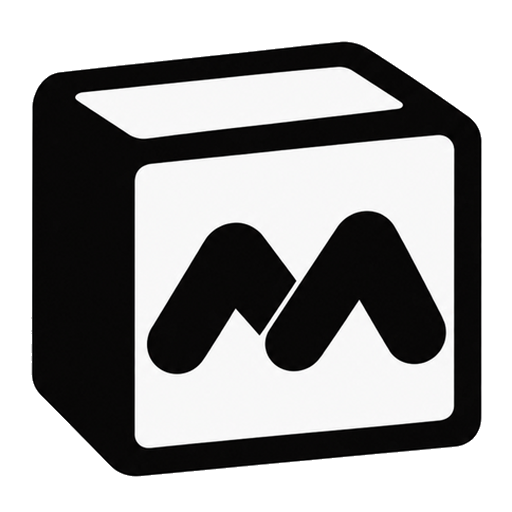
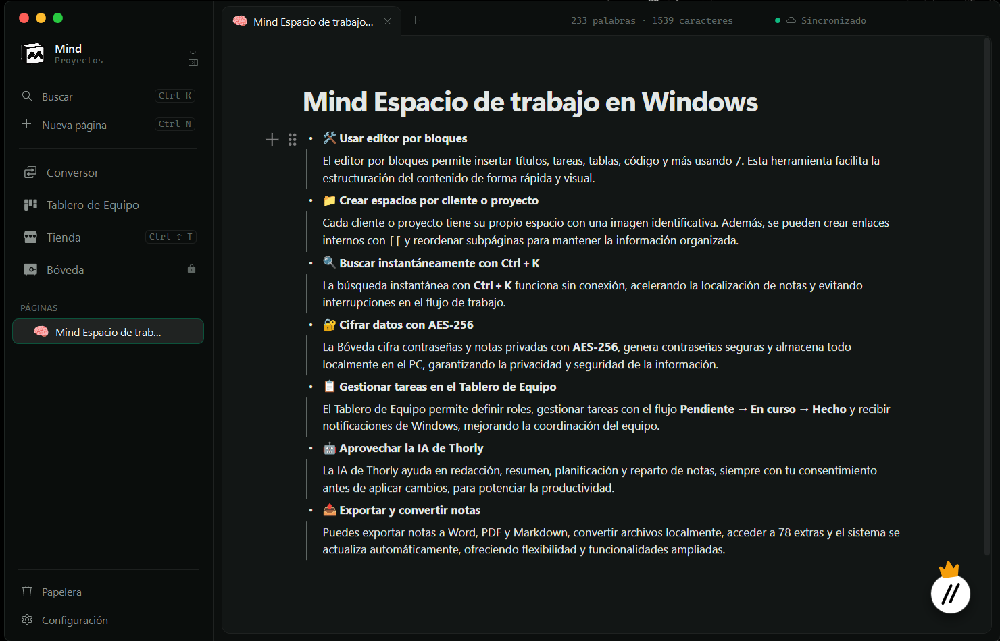
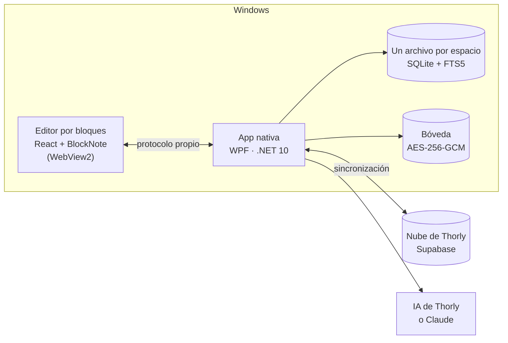

# Mind by Thorly

**El espacio de trabajo de escritorio para profesionales y equipos.**
Documentación, proyectos, clientes, actas, contraseñas y las tareas del equipo en un mismo sitio.

[**Web**](https://thorly.dev/mind.html) · [**Descargar**](https://thorly.dev/downloads/mind/Mind-Setup.exe) · [**Novedades**](CHANGELOG.md) · [**Hoja de ruta**](ROADMAP.md) · [**Thorly**](https://thorly.dev)

 

---

> [!NOTE]
> Este repositorio es el **escaparate público** de Mind: novedades, hoja de ruta y el sitio para reportar
> fallos o pedir funciones. El código fuente es privado.

## Índice

- [Qué es](#qué-es)
- [Funciones](#funciones)
- [Planes](#planes)
- [Descargar](#descargar)
- [Cómo está hecha](#cómo-está-hecha)
- [En números](#en-números)
- [Novedades y hoja de ruta](#novedades-y-hoja-de-ruta)
- [Reportar un fallo o pedir una función](#reportar-un-fallo-o-pedir-una-función)

## Qué es

Mind es una app nativa para Windows donde cabe el trabajo de todos los días: la documentación de
un proyecto, las notas de una reunión, la ficha de un cliente, las contraseñas de trabajo o el
reparto de tareas del equipo. Todo se guarda solo mientras escribes, en tu PC y, si quieres,
sincronizado con tu cuenta de Thorly.

Es el tercer proyecto de [Thorly](https://thorly.dev), junto a Thorly IA e ImaThorly.

## Funciones

### 📝 Trabajo propio

| | |
|---|---|
| **Editor por bloques** | Títulos, listas, tareas, tablas, citas, código e imágenes. El menú <kbd>/</kbd> inserta cualquier cosa, también widgets y stickers. |
| **Espacios** | Uno por cliente, proyecto o departamento, cada uno con su imagen. |
| **Páginas enlazadas** | Subpáginas que se arrastran, enlaces con <kbd>[[</kbd> y la lista de quién enlaza a quién. |
| **Iconos con color** | Más de 1.500 iconos en seis grosores y 18 colores, 1.600 emojis en tres estilos y logos de marca. |
| **Búsqueda al instante** | <kbd>Ctrl</kbd> + <kbd>K</kbd> encuentra cualquier palabra en todas tus páginas, con o sin tildes y sin conexión. |
| **Plantillas** | Actas, informes, planes de proyecto… junto a la hoja en blanco. |
| **Exportar e importar** | Word, PDF, Markdown, HTML, texto y JSON, sin servicios de por medio. |
| **Conversor de archivos** Pro | Documentos, hojas de cálculo, imágenes, PDF (con OCR), audio y vídeo, convertidos en tu propio PC. |

### 🔒 Bóveda

Contraseñas, accesos de clientes y notas privadas detrás de una contraseña que solo sabes tú.
Se cifra en tu PC con **AES-256-GCM** (clave derivada con PBKDF2-SHA256, 600.000 iteraciones) y
**nunca sube a la nube**. Genera contraseñas seguras, las copia con un clic (se borran del
portapapeles a los 30 segundos) y se cierra sola cuando dejas de usarla.

### 👥 Tablero de Equipo

| | |
|---|---|
| **Equipos** | Con jefe, coordinadores y miembros, cada uno con su foto o logo y su color. |
| **Tablero de tareas** | *Pendiente · En curso · Hecho*, con responsable, prioridad y fecha límite. Las tarjetas se arrastran. |
| **Compañeros** | Amigos por correo y una ficha con foto, biografía (con enlaces) y gorro. |
| **Avisos** | Campana de novedades y notificaciones de Windows cuando te asignan una tarea. |

### ✨ IA de Thorly

| | |
|---|---|
| **Un asistente por trabajo** | Mejorar la redacción, desarrollar, resumir, planificar, sacar tareas o repartir unas notas en varias páginas. |
| **Dar estilo a la página** | Esquema, Cornell, preguntas y respuestas, paso a paso, tabla, glosario o fichas. |
| **Tú decides** | Nada se aplica sin que lo aceptes, y todo se deshace con <kbd>Ctrl</kbd> + <kbd>Z</kbd>. |
| **Con tu propia clave** | Conecta tu cuenta de Claude y la IA sale de ahí. |

### 🎨 A tu gusto

| | |
|---|---|
| **Tienda** | 78 extras en seis estanterías: skills de IA, plantillas, widgets, stickers, temas y gorros. |
| **Conexiones** | Claude y GitHub (traer issues y pull requests, convertir una página en issue). |
| **Nueve estilos de ventana** | Semáforo de Mac, Windows 11, Mica translúcido, minimalista… en tema claro u oscuro. |
| **Local o Nube** | Sin cuenta y sin conexión, o sincronizado entre tus PCs. Se pasa de uno a otro sin perder nada. |
| **Se actualiza sola** | La versión nueva se instala al cerrar la app. |

## Planes

| | Free | Pro |
|---|:---:|:---:|
| Páginas, espacios y exportar | ✅ Sin límite | ✅ Sin límite |
| Bóveda cifrada | ✅ | ✅ |
| Sincronización en la nube | ✅ | ✅ |
| Tablero de Equipo | ✅ | ✅ |
| IA de Thorly | Cada día, para probarla | Se recarga cada 5 horas |
| Conversor de archivos | — | ✅ |
| Extras Pro de la tienda | — | ✅ |

Precios y cómo activarlo en [thorly.dev/mind.html](https://thorly.dev/mind.html#planes).

## Descargar

1. Descarga [**Mind-Setup.exe**](https://thorly.dev/downloads/mind/Mind-Setup.exe) (Windows 10 2004 o Windows 11).
2. Ábrelo. Si a tu PC le falta .NET 10 o WebView2, el instalador los descarga solo.
3. Elige **Local** o **Nube** y empieza a escribir. Las versiones nuevas se instalan solas.

> [!TIP]
> Si Windows muestra «Windows protegió tu PC», pulsa «Más información» y después «Ejecutar de todas
> formas». Aparece porque el instalador todavía no tiene firma digital.

## Cómo está hecha

- **Nativa donde importa, web donde conviene.** Todo lo que rodea al texto es WPF; el editor es una
  app React dentro de WebView2. Las dos mitades hablan por un protocolo propio con versión.
- **Rápida con espacios grandes.** El árbol, los favoritos y la papelera nunca cargan el contenido
  de las notas; mover o renombrar no reescribe el texto ni rehace el índice de búsqueda.
- **Sin servidores para convertir.** El conversor usa lo que ya trae Windows (WIC, Media Foundation,
  OCR) y lectores propios de Word, Excel, OpenDocument, RTF y EPUB.
- **La nube manda en los permisos.** Los equipos viven en tablas sin acceso directo: solo se tocan
  desde funciones que comprueban el rol de quien llama.
- **Ligera en reposo.** Con la ventana al fondo, las consultas a la nube se espacian solas.
- **Publicación automática.** Cada versión se compila, se prueba y se empaqueta en Windows con
  GitHub Actions y Velopack, y llega a los usuarios como una actualización de pocos KB.

## En números

| | |
|---|---|
| Versiones publicadas | **17** en 10 días (de la 0.1.0 a la 0.9.5) |
| Pruebas automáticas | **400+** (núcleo, datos y editor) |
| Iconos y emojis | **1.512** iconos × 6 grosores · **1.655** emojis × 3 estilos |
| Extras en la tienda | **78** |
| Formatos del conversor | **33** |

## Novedades y hoja de ruta

- 📜 [**CHANGELOG.md**](CHANGELOG.md): qué trae cada versión.
- 🗺️ [**ROADMAP.md**](ROADMAP.md): lo que viene.

## Reportar un fallo o pedir una función

Abre un [**issue**](../../issues/new/choose) con la plantilla que toque: «Algo no funciona» o «Tengo una idea».
Cuanto más concreto, antes se arregla: qué hiciste, qué esperabas y qué pasó (una captura ayuda mucho).

---

Hecho por <a href="https://github.com/DavidZx3">David.Zx3</a> · © 2026 David.Zx3. Todos los derechos reservados.

